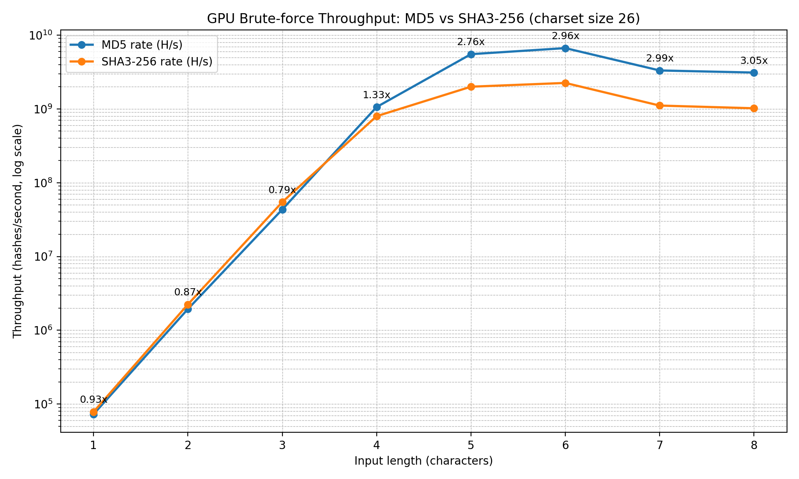
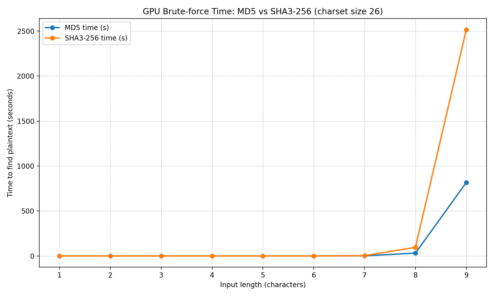

# md5_gpu_bruteforce (GPU / OpenCL)

Educational security demo that makes **“MD5 is weak”** tangible by showing how quickly a GPU can brute-force short inputs.

This repo contains:
- A **GPU-accelerated MD5 preimage demo** (OpenCL via PyOpenCL)
- A **GPU-accelerated SHA3-256 preimage demo** (Keccak / SHA3)
- A small benchmarking workflow to compare throughput and time across input lengths

> Important framing for students  
> - **MD5 is broken for collision resistance** and must not be used for security-relevant hashing.  
> - **SHA3-256 is cryptographically stronger than MD5**, but it is still a *fast* hash.  
> - For password storage, the correct mitigation is a **slow / memory-hard password hash** (Argon2 / scrypt / bcrypt) plus high-entropy secrets.

---

## What this demo is (and is not)

### ✅ This repo demonstrates
- **GPU parallelism** via OpenCL kernels (low-level programming)
- **Brute-force feasibility** for weak/short secrets (preimage search against a known hash)
- A practical comparison: **MD5 vs SHA3-256** on the same GPU

### ❌ This repo does NOT
- Provide a real-world “universal cracker”
- Generate *MD5 collisions* (that is a different topic and uses different techniques)

---

## Quick start (Ubuntu)

### 1) System dependencies
```bash
sudo apt update
sudo apt install -y git openssh-client python3-venv python3-pip ocl-icd-opencl-dev opencl-headers
```

### 2) Python venv + deps
```bash
cd md5_gpu_bruteforce
python3 -m venv venv
source venv/bin/activate
pip install --upgrade pip
pip install -r requirements.txt
```

### 3) Run the MD5 demo
```bash
./md5_collision_GPU.py
```

### 4) Run the SHA3-256 demo
```bash
./sha3_gpu_bruteforce_demo.py
```

---

## Scripts

### `md5_collision_GPU.py`
- GPU brute-force **MD5** preimage demo
- Automatically infers a realistic charset class from the input (digits / lower / upper / letters / alnum / printable ASCII)
- Prints:
  - target plaintext (for demo)
  - target MD5 hash
  - measured throughput (**hashes/sec**)
  - progress + ETA

### `sha3_gpu_bruteforce_demo.py`
- Same demo pattern for **SHA3-256**
- Prints the target **SHA3-256** hash and measures throughput

### Benchmark driver (optional)
If you use a benchmark driver to produce the table below, keep the maximum length modest (e.g., **N=8**).  
Lengths ≥ 9 grow quickly even with a GPU.

---

## Choosing a “hackable” string (live demo)

Expected time (average-case) depends on:
- Charset size **C**
- Length **L**
- Measured speed **R** (hashes/sec)

Average-case time:
\[
t \approx \frac{C^L}{2R}
\]

**Practical live demo guidance** (example, GPU measured around a few GH/s):
- Lowercase (C=26), **L=8** → tens of seconds to a couple of minutes (excellent for live demo)
- Alnum (C=62), **L=6** → a few seconds

---

## MD5 vs SHA3-256 comparison (measured)

The table below was measured on an **NVIDIA GeForce RTX 5060 Ti** with charset size **26** (lowercase).  
It illustrates the key point: **SHA3-256 is slower than MD5**, but still fast enough that weak secrets are brute-forceable.

| Len | Charset | MD5 Rate | MD5 Time(s) | SHA3-256 Rate | SHA3-256 Time(s) | Speedup (MD5/SHA3) |
|---:|---:|---:|---:|---:|---:|---:|
| 1 | 26 | 72.84 KH/s | 0.00 | 80.52 KH/s | 0.00 | 0.90x |
| 2 | 26 | 1.99 MH/s | 0.00 | 2.21 MH/s | 0.00 | 0.90x |
| 3 | 26 | 49.24 MH/s | 0.00 | 33.78 MH/s | 0.00 | 1.46x |
| 4 | 26 | 933.01 MH/s | 0.00 | 810.47 MH/s | 0.00 | 1.15x |
| 5 | 26 | 5.68 GH/s | 0.00 | 2.00 GH/s | 0.01 | 2.84x |
| 6 | 26 | 6.67 GH/s | 0.05 | 2.24 GH/s | 0.14 | 2.98x |
| 7 | 26 | 3.32 GH/s | 1.20 | 1.11 GH/s | 3.60 | 2.99x |
| 8 | 26 | 3.11 GH/s | 31.46 | 1.02 GH/s | 95.14 | 3.05x |
| 9 | 26 | 3.08 GH/s | 815.65 | 998.97 MH/s | 2514.59 | 3.08x |

### Graphs
Add the generated images to the repository (suggested location: `docs/`) and the README will render them on GitHub.

**Throughput (log scale):**


**Time-to-find (seconds):**


---

## Security & legal disclaimer

**RESTRICTED USE — READ CAREFULLY**

This repository is provided strictly for:
- security training
- internal awareness
- defensive verification in controlled lab environments

It must not be used for unauthorized access attempts, password cracking against systems you do not own/operate with explicit permission, or any activity that violates laws, policies, or ethics.

By using or modifying this repository, you accept full responsibility for compliant use.

---

## Repo contents (typical)
- `md5_collision_GPU.py` — MD5 GPU brute-force demo
- `sha3_gpu_bruteforce_demo.py` — SHA3-256 GPU brute-force demo
- `requirements.txt` / `requirements-lock.txt`
- `HOW-TO.md` — environment setup guide
- `docs/` — graphs/images for the README (recommended)

---

## Notes for instructors
- Keep the demo ethical: use synthetic data and an isolated lab machine.
- Emphasize the right lesson: **fast hashes are bad for password storage**; use Argon2/bcrypt/scrypt.
